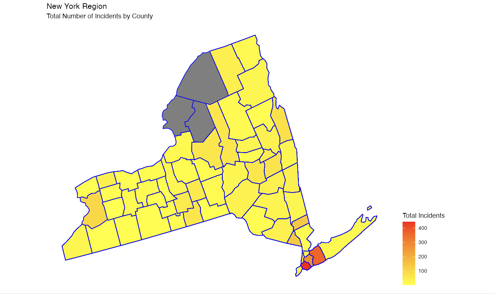

# Project 2: Shiny App Development

### [Project Description](doc/project2_desc.md)

Term: Fall 2023



In this second project of GR5243 Applied Data Science, we develop a *Exploratory Data Analysis and Visualization* shiny app using one of **the OpenFEMA data sets** of your choice. See [Project 2 Description](doc/project2_desc.md) for more details.  

The **learning goals** for this project is:

- business intelligence for data science
- data cleaning
- data visualization
- systems development/design life cycle
- shiny app/shiny server

*The above general statement about project 2 can be removed once you are finished with your project. It is optional.

## Project 2 Shiny App
Term: Fall 2023

+ Team # 12
+ **Projec title**: + Disaster Declarations Summaries
	+ Jiaqi Lu
	+ Yuqi Liu
	+ Guanbiao Li
	+ Tianyi Jiang

+ **Shiny App Link**: https://dataevan.shinyapps.io/Shinyapp-12/
	
+ **Project summary**: We aim to develop a mobile application specifically designed for government agencies, enabling them to summarize and analyze historical disaster data swiftly. This application will facilitate these agencies in conducting comprehensive analyses of past disasters, which, in turn, will inform their decision-making processes regarding funding allocations and budgeting strategies. By leveraging this data, the government can make more informed decisions, optimize the allocation of resources to areas most in need, and improve disaster response and preparedness strategies.

+ **Contribution statement**: ([default](doc/a_note_on_contributions.md))
	+ Jiaqi Lu: Shiny app design
	+ Yuqi Liu: Graph: Distribution of Top 5 Disasters by State and Year
	+ Guanbiao Li: Graph: New York Region - Total Number of Incidents by County
	+ Tianyi Jiang: Graph: Distribution of Aid Programs in New York State

Following [suggestions](http://nicercode.github.io/blog/2013-04-05-projects/) by [RICH FITZJOHN](http://nicercode.github.io/about/#Team) (@richfitz). This folder is orgarnized as follows.

```
proj/
├── app/
├── lib/
├── data/
├── doc/
└── output/
```

Please see each subfolder for a README file.

